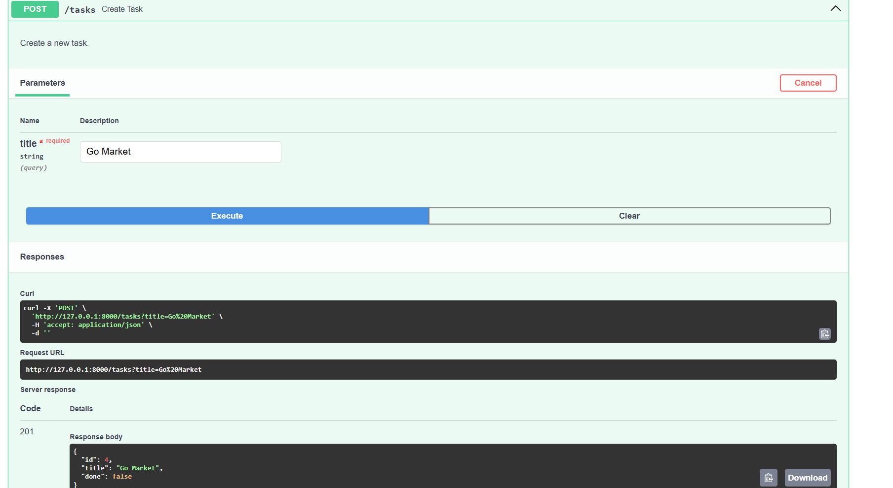
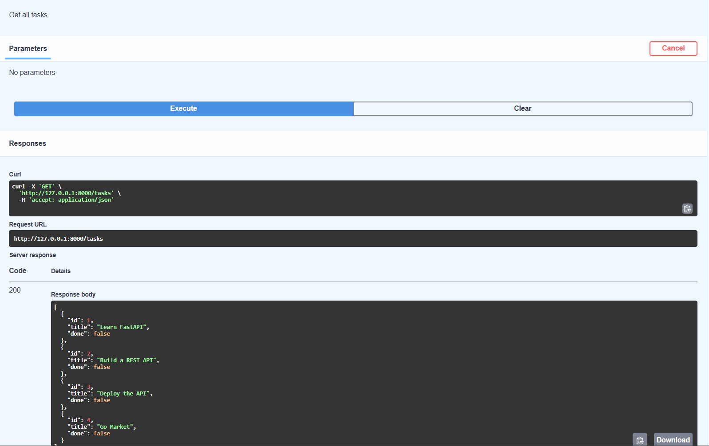
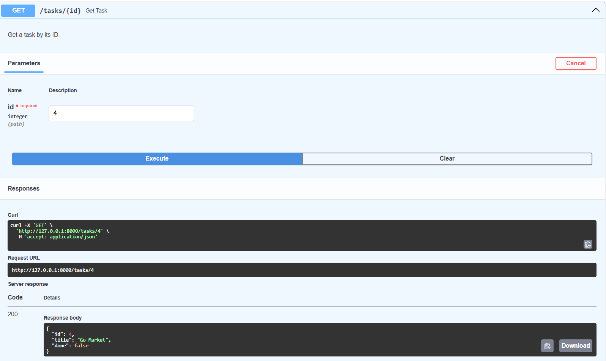
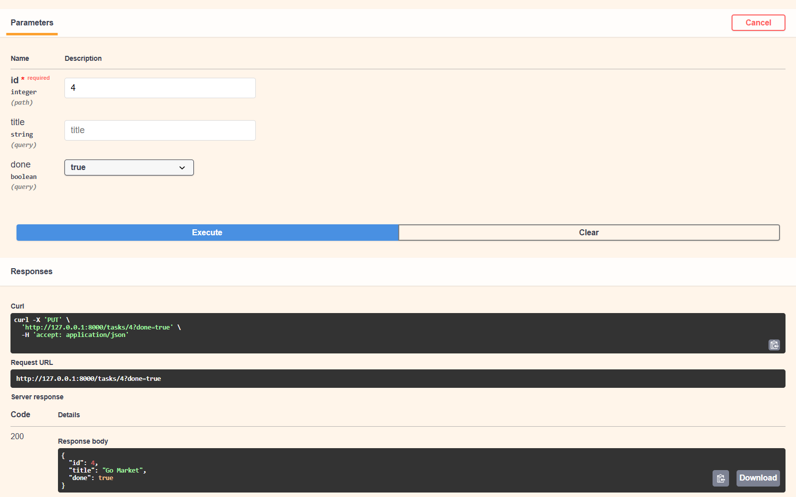
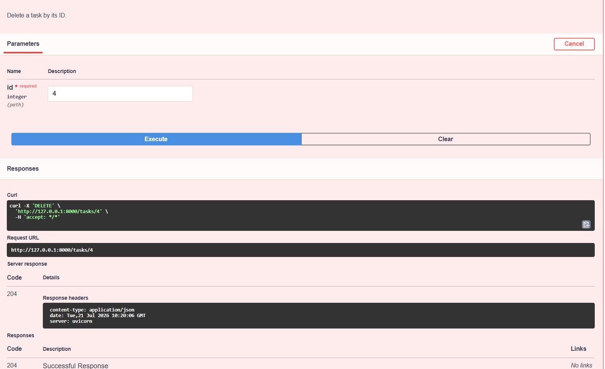
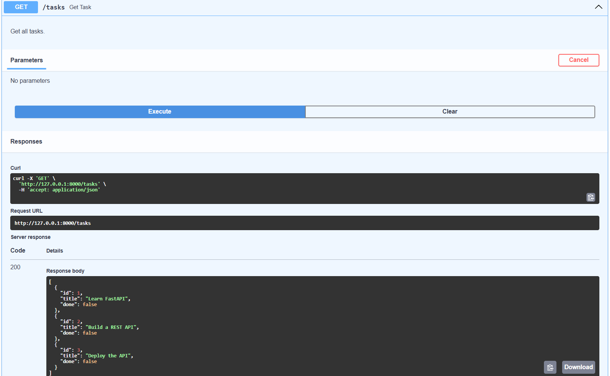
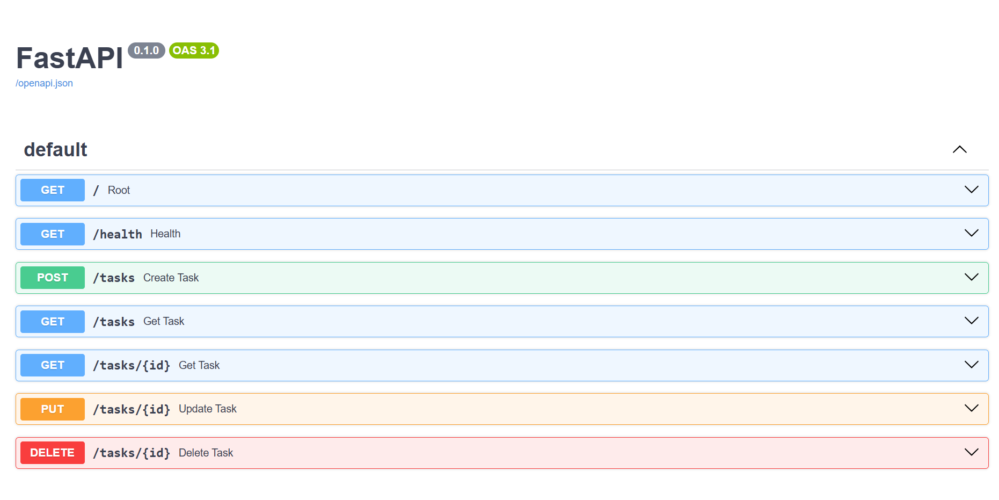

# 📝 Task API (FastAPI)

A simple CRUD API built with **FastAPI** to manage tasks. This project shows how to build, validate, and document an API using FastAPI.

---

## 🚀 Features
- Root and health endpoints
- CRUD operations for tasks:
  - Create (POST)
  - Read (GET all / by ID)
  - Update (PUT)
  - Delete (DELETE)
- Auto-generated API docs at `/docs`
- ReDoc available at `/redoc`

---

## 🛠 Tech Stack
- Python 3.10+
- FastAPI
- Pydantic
- Uvicorn

---

## ▶️ Run the Project
Install dependencies:

```bash
pip install fastapi uvicorn
```

Run the application:

```bash
uvicorn main:app --reload
```

Open the API docs in your browser:

- Swagger UI: `http://127.0.0.1:8000/docs`
- ReDoc: `http://127.0.0.1:8000/redoc`

---

## 📌 Endpoints

| Method | Endpoint    | Description           |
|--------|-------------|-----------------------|
| GET    | /           | Root information      |
| GET    | /health     | Health check          |
| GET    | /tasks      | List all tasks        |
| GET    | /tasks/{id} | Get a task by ID      |
| POST   | /tasks      | Create a new task     |
| PUT    | /tasks/{id} | Update a task by ID   |
| DELETE | /tasks/{id} | Delete a task by ID   |

---

## 📡 Example Request

Create a new task:

```bash
curl -i -X POST "http://127.0.0.1:8000/tasks?title=Buy%20milk"
```

Example response:

```json
{"id":4,"title":"Buy milk","done":false}
```

---

## 📸 Swagger UI Demo

The following screenshots illustrate the CRUD flow in Swagger UI.

### Create Task


### Get All Tasks


### Get Task by ID


### Update Task


### Delete Task


### Remaining Tasks After Delete


### List All Endpoints


